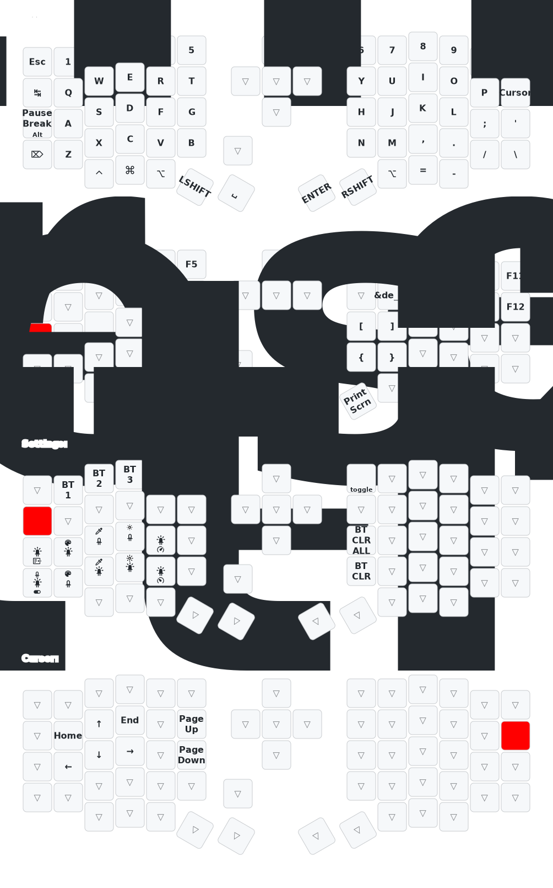

# Sofle ZMK

## Whats this?

A repository for my Sofle split ergo mechanical keyboard equipped with a Nice!Nano controller and battery and running with ZMK.

## The Hardware

### Aliexpress Keyboard

A cheap(ish) keyboard from Aliexpress. According to product page it has the following specs:

- Controller: not specified, seems to be a nice!nano v2
- Display: nice!view
- Battery: 2000mAh
- Left half: Encoder
- Right half: Joystick

### Self-soldered

## The Software

The basic layer is a colemak layout with additional chars like german umlauts on a alternative layer.
In the settings layer the keyboard is changeable to a qwerty-laoyut

## The Keymap

## TODOs

- [X] Basic System with QWERTY layout
- [X] Encoder
- [X] Joystick
- [X] Battery Level
- [X] RGB LEDs
- [X] Power management
- [X] Layer: Umlauts and special chars
- [X] Layer: Settings
- [X] Linux Compose keys
- [X] Display Left: Layer and WPS Graph
- [X] Display Right: Logo
- [ ] Display Right: Arasaka Logo
- [X] RGB Lighting: Basic function
- [X] RGB Lighting: Layer depending colors
- [ ] RGB Lighting: Highlight key with alt function
- [ ] Caps-Word on left+right shift
- [ ] ZMK Studio
- [X] Github Action: Keymap Drawer

## Links

Maybe interesting links:

- <https://aliexpress.com/item/1005007822133003.html>
- <https://github.com/a741725193/zmk-sofle/tree/main>
- <https://github.com/infely/nice-view-battery>
- <https://github.com/urob/zmk-helpers/tree/main>
